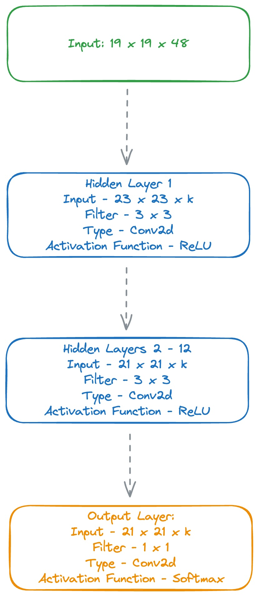

# Building the Policy Network
<span class="date">*29th September 2024*</span>

Time to start implementing some actual neural networks. The first network we will build is the Policy Network. In classical reinforcement learning, the policy network is the part of the programme that decides which action to take in a given state, so here that would be which move to play in a given board position. For AlphaGo, things are slightly more complicated, but we'll try it anyway. The Policy Network is used to narrow the scope of potential moves that the rest of the programme has to consider. It outputs a probability distribution over all possible moves in a given state, and from that we can select the most promising moves i.e. the ones with the highest probability.

## What is the Policy Network?

The Policy Network component of AlphaGo is built using two different training processes. A supervised learning process where the network learns from games played by human experts, and a reinforcement learning process where the network plays itself and learns from the outcomes of those games. This is actually described at 11:45 in the [AlphaGo documentary](https://youtu.be/WXuK6gekU1Y?t=709).

### Supervised Learning

The supervised learning process is a _"13 layer policy network"_, trained on _"30 million positions from the KGS Go Server."_ Seems like most other supervised learning processes. Feed in the board position as the input and use the move played by the human expert as the output. This should give the model a solid understanding of what good moves look like, which it can then build on during reinforcement learning.

Unfortunately, after reading the paper again, it's not quite as simple as passing in the current board position and getting the move played as the output. They first augment the data by rotating and flipping the board position to increase the size of the dataset. In total there are 48 different input features that they use. They do list out what these features are beyond the simple board position on page 26 of the [AlphaGo paper](https://storage.googleapis.com/deepmind-media/alphago/AlphaGoNaturePaper.pdf), but they shouldn't affect the function of the network too much, so for simplicity, we'll stick to just the board position.

The architecture of the policy network is described in the [Appendix](https://storage.googleapis.com/deepmind-media/alphago/AlphaGoNaturePaper.pdf) and looks as follows:

<div style="text-align: center;">
    
</div>

Looks reasonable. We can build that.

### Reinforcement Learning

_"The RL policy network pρ is identical in structure to the SL policy network, and its weights ρ are initialised to the same values, ρ = σ. We play games between the current policy network pρ and a randomly selected previous iteration of the policy network."_

That seems easy enough, we have a Go implementation, so we can just play games between the current policy network and a previous iteration of the policy network and leave it run. God, this is so easy!

## Stealing Data

Before we actually start building any networks, it would be good to have some data to train on. Unfortunately, I'm not DeepMind, so I don't have access to a database of 30 million Go positions from the KGS Go Server. Instead, I'll have to steal it from someone else. Luckily, that someone else exists and is very easy to find. An incredible individual named [Joseph Redmon](https://pjreddie.com/#google_vignette) has compiled exactly the [dataset](https://pjreddie.com/projects/jgdb/) we need and made it openly available to everyone! What a hunk!

As a side note, I also found [this GitHub](https://github.com/featurecat/go-dataset) repo while writing this up. That might work even better.

Excellent! We can now move on to building the network.

## Building the Policy Network

We'll use PyTorch to build the model because that's what everyone seems to be using nowadays. Let's have a class called `PolicyNetwork` that inherits from `nn.Module` and has a `forward` method that takes in a board position and outputs a probability distribution over all possible moves.

In addition to the diagram, the paper lists the k value used (the number of filters in the convolutional layers) as 192, and the kernel size as 3x3. The final layer is a fully connected layer with 19x19 outputs, one for each possible move on the board. We don't need to apply the Softmax function as the Cross Entropy Loss function in PyTorch does that for us and expects raw logits as input.

```python
class PolicyNetwork(nn.Module):
    def __init__(self, board_size=19, input_features=48, hidden_layers=12):
        super(PolicyNetwork, self).__init__()
        self.board_size = board_size
        self.input_features = input_features
        self.hidden_layers = hidden_layers
        self.conv1 = nn.Conv2d(in_channels=self.input_features, out_channels=192, kernel_size=5, stride=1, padding=2)
        self.relu2 = nn.ReLU()
        # Create a list of repeated conv layers
        self.repeated_convs = nn.ModuleList(
            [
                nn.Sequential(
                    nn.Conv2d(in_channels=192, out_channels=192, kernel_size=3, stride=1, padding=1), nn.ReLU()
                )
                for _ in range(self.hidden_layers - 1)
            ]
        )
        self.final_conv = nn.Conv2d(in_channels=192, out_channels=1, kernel_size=1, stride=1)

    def forward(self, x):
        x = self.conv1(x)
        x = self.relu2(x)
        # Pass through repeated conv + relu layers
        for i, conv_relu in enumerate(self.repeated_convs):
            x = conv_relu(x)
        x = self.final_conv(x)

        return x
```

Since the second to twelfth layers are just the same repeated convolutional layers with ReLU activations, we can loop through them rather than typing each out, so big win there.

## Attempting to Run

General AI superstar [Andrej Karpathy](https://karpathy.ai) once wrote a tweet:

<blockquote class="twitter-tweet"><p lang="en" dir="ltr">most common neural net mistakes: 1) you didn&#39;t try to overfit a single batch first. 2) you forgot to toggle train/eval mode for the net. 3) you forgot to .zero_grad() (in pytorch) before .backward(). 4) you passed softmaxed outputs to a loss that expects raw logits. ; others? :)</p>&mdash; Andrej Karpathy (@karpathy) <a href="https://twitter.com/karpathy/status/1013244313327681536?ref_src=twsrc%5Etfw">July 1, 2018</a></blockquote> <script async src="https://platform.twitter.com/widgets.js" charset="utf-8"></script>

Most times I tend to ignore advice, such as heatlh, finance, relationships, the usual, but I think I'll take this one to heart. Let's try to overfit a single datapoint first. We can input a blank 19x19 board and have a one-hot encoded tensor as the target output. We can do this in a `train.py` file inside a `train_policy_network` function.

This function will do a few things:

1. Initialise the Policy Network class
2. Create the loss function object
3. Create the optimizer object
4. Create a dummy item of data
    - Input: An empty 19x19 board (a 1x1x19x19 tensor, 1 as the batch size, 1 as the number of features, 19x19 as the board size)
    - Output: A one-hot encoded tensor of the target move. The target move will be 1 and the rest will be 0.
5. Pass the data through the network
6. Calculate the loss
7. Backpropagate the loss
8. Update the weights
9. Repeat
10. Party

```python
def train_policy_network(
    input_features: int, hidden_layers: int, learning_rate: float, board_size: int, iterations: int
) -> PolicyNetwork:
    """
    This function trains the policy network using the specified configuration.
    """
    # Device setup
    device = torch.device("mps") if torch.backends.mps.is_available() else torch.device("cpu")
    logger.info(f"Using device: {device}")

    # Network initialization
    network = PolicyNetwork(input_features=input_features, hidden_layers=hidden_layers).to(device)

    # Loss function and optimizer
    criterion = torch.nn.CrossEntropyLoss()
    optimizer = optim.SGD(network.parameters(), lr=learning_rate)

    # Create single data point for testing - blank board as input, single move as target
    inputs = torch.randn(1, input_features, board_size, board_size).to(device)
    targets = torch.zeros(1, board_size ** 2).to(device)
    targets[0, 0] = 1

    losses = []
    for _ in range(iterations):
        inputs, targets = inputs.to(device), targets.to(device).float()

        # Forward pass
        outputs = network(inputs)
        loss = criterion(outputs, targets)

        # Backward pass and optimize
        optimizer.zero_grad()
        loss.backward()
        optimizer.step()

        losses.append(loss)
        logger.info(f"Loss: {loss:.4f}")

    return network, losses
```

We can call this from a main file like a good little Python programmer and hopefully see some losses decreasing.

```python
from loguru import logger

from train import train_policy_network

if __name__ == "__main__":
    # Define the configuration because we're fancy
    config = {
        "input_features": 1,
        "hidden_layers": 11,
        "learning_rate": 1e-3,
        "board_size": 19,
        "iterations": 1000,
    }

    # Train the policy network
    trained_network, losses = train_policy_network(
        input_features=config["input_features"],
        hidden_layers=config["hidden_layers"],
        learning_rate=config["learning_rate"],
        board_size=config["board_size"],
        iterations=config["iterations"],
    )

    # Log finishing
    logger.info("Policy network trained.")
```

Let's give this a run...

<div style="text-align: center;">
    
</div>

Shit.

The hell does this mean.

Looks like it's running through the network fine since we are getting to the Cross Entropy stage, but then it's having a problem. Maybe our output and target are different? Our target is a 2D tensor, 1x361, let's see what our outputs look like.

<div style="text-align: center;">
    
</div>

Ah okay, so our output is still a 19x19 go board, so we need to flatten it to make the comparison in the loss calculation work. I wonder if we can just reshape the final output at the end of the `forward()` function.

```python
class PolicyNetwork(nn.Module):
    def __init__(self, board_size=19, input_features=48, hidden_layers=12):
        super(PolicyNetwork, self).__init__()
        self.board_size = board_size
        self.input_features = input_features
        self.hidden_layers = hidden_layers
        self.conv1 = nn.Conv2d(in_channels=self.input_features, out_channels=192, kernel_size=5, stride=1, padding=2)
        self.relu2 = nn.ReLU()
        # Create a list of repeated conv layers
        self.repeated_convs = nn.ModuleList(
            [
                nn.Sequential(
                    nn.Conv2d(in_channels=192, out_channels=192, kernel_size=3, stride=1, padding=1), nn.ReLU()
                )
                for _ in range(self.hidden_layers - 1)
            ]
        )
        self.final_conv = nn.Conv2d(in_channels=192, out_channels=1, kernel_size=1, stride=1)

    def forward(self, x):
        x = self.conv1(x)
        x = self.relu2(x)
        # Pass through repeated conv + relu layers
        for i, conv_relu in enumerate(self.repeated_convs):
            x = conv_relu(x)
        x = self.final_conv(x)
        x = x.view(x.size(0), -1)

        return x
```

Let's try this again...

<div style="text-align: center;">
    
</div>

Nice! It is actually working. But....it doesn't seem to be working very well for such a simple task. The loss is decreasing, but it's decreasing very slowly. I wonder if we need to increase the learning rate or the number of iterations. Let's leave it running for a bit and see what happens.

<div style="text-align: center;">
    
</div>

Excellent, so it is working and will fit to a single example. Next step is to actually train it on some real data. Unfortunately, I've never actually worked with, or even seen, Go data before, so this might take some work and a lot of messing around. I'll start by loading in the data and seeing what it looks like. Our dataset is already split into training, validation, and testing, with `.txt` files for each containing paths to the Go files themselves. So what's in the Go files?

Actually, what the hell kind of format is this in? `.sgf`? The fuck is that?

<div style="text-align: center;">
    
</div>

Right, so not only does this game have its own file format, the file format itself has a [Wikipedia page](https://en.wikipedia.org/wiki/Smart_Game_Format#:~:text=The%20Smart%20Game%20Format%20(SGF,format%20and%20is%20the%20default.). Mental.

Cool, so how do we read in `.sgf` format. Any helpful guides online?

So there seems to be this [library](https://mjw.woodcraft.me.uk/sgfmill/) called `sgfmill` which will help from a lovely individual called [Matthew Woodcraft](https://mjw.woodcraft.me.uk).

Let's open a notebook for a real play around. We'll go into `train.txt` and extract the paths.

```python
DATA_DIR = '../data/go_games'

with open(os.path.join(DATA_DIR, 'train.txt'), 'r') as file:
    paths = file.readlines()
```

Now we should be able to start reading in Go games, based on the [examples](https://mjw.woodcraft.me.uk/sgfmill/doc/1.1.1/examples.html) in the `sgfmill` documentation.

```python
import sgfmill

test_path = os.path.join(DATA_DIR, paths[0].strip())

with open(test_path, "rb") as f:
    game = sgf.Sgf_game.from_bytes(f.read())
winner = game.get_winner()
print(winner)
```

We get an output! `b`. I'm assuming that means black won. Let's see if we can extract the moves.

```python
main_sequence = game.get_main_sequence()

for node in main_sequence:
    print(node.get_move())
```

<div style="text-align: center;">
    
</div>

Incredible! We can now read in Go games. The next step is to convert these moves into a format that we can use to train the network. We need to convert the board position into a tensor and the subsequent move into a one-hot encoded tensor. Let's make a function called `extract_board_state_and_move()` that does what is says on the tin, returning two tuples, one for the board state and one for the move.

I'm likely just missing it, but I can't seem to find a function in the `sgfmill` library that will give me the board state at a given move. I can get the move, but not the board state. We'll have to write our own function to do this. For that, we can use another handy tool from `sgfmill` called `board`. This will allow us to create a board object and update it with each move as we move through a game.

```python
def initialize_board(board_size: int = 19):
    """
    This function initializes a Go board with the specified size.
    """
    return boards.Board(board_size)


def board_to_tensor(board: boards.Board):
    """
    This function converts a Go board to a tensor.
    """
    board_size = board.side
    tensor = np.zeros((board_size, board_size), dtype=int)

    for row in range(board_size):
        for col in range(board_size):
            stone = board.get(row, col)
            if stone == "b":
                tensor[row, col] = 1
            elif stone == "w":
                tensor[row, col] = -1

    return tensor


def extract_board_state_and_moves(
    main_sequence: List[sgf._Root_tree_node],
) -> List[List[torch.tensor], List[Any, Any]]:
    """
    This function extracts the board state and next move from the main sequence of moves in an SGF file.
    """
    board = initialize_board()
    board_states = []
    next_moves = []

    for node in main_sequence:
        move = node.get_move()
        if move[0] is not None:
            color, (row, col) = move
            board_state = board_to_tensor(board)
            board_states.append(board_state)
            next_move_index = row * board.side + col  # Flatten the board coordinates
            total_moves = board.side * board.side
            one_hot_move = np.zeros(total_moves, dtype=int)  # Want to return a one-hot encoded vector
            one_hot_move[next_move_index] = 1
            next_moves.append(one_hot_move)
            board.play(row, col, color)

    return board_states, next_moves
```

For some reason the first move is always `None`, so we need to check for that and ignore it. As we go through each turn, we first get the board state and convert it to a tensor, this will help us input it into our model. To do this, we basically iterate over the board, find the colour of the stone placed there, update it to a `1` or `-1` depending on the colour, add it to the ongoing board tensor, and then return that tensor, appending it to our overall list of board states. 

To get a one-hot encoded vector of the move it's slightly trickier. We are given a coordinate as a tuple of the row and column of the move. Some nice Googling gives us a nice little formula to go from a 2D coordinate to a 1D index. The index is given by `row * board_size + col`. We can then create a blank tensor the length of the total number of possible moves (the board size squared), and update the index of the next move to be 1. We can then append this ot the list of `next_moves` and go to the next. Finally we return the accumulated list of board states and moves.

Finally, let's save this as an NPZ (a NumPy file type) file so we can load it in later and combine it all together in a function called `process_sgf_file()`.

```python
def store_data(board_states: List[torch.tensor], file_path: str, next_moves: Tuple[Any, Any]):
    """
    This function stores the board states and next moves in an NPZ file.
    """
    np.savez(file_path, board_states=board_states, next_moves=next_moves)


def process_sgf_file(file_path: str, output_path: str):
    main_sequence = load_sgf(file_path)
    board_states, next_moves = extract_board_state_and_moves(main_sequence)
    store_data(board_states, next_moves, output_path)
```

Lovely. We can now process data ready for our network, there's just a couple more steps to actually hook it up to the network and start training.

We can have a new function called `get_input_data()` that will load in the data from the NPZ file. After loading, we need to convert the board state and next move to PyTorch tensors, so they will work with our network. To do this we simple need to split the data into the board states and next moves and call the `torch.tensor()` function on them. Finally, we can combine the board states and next moves into a `TensorDataset` object because PyTorch likes that, and then create a `DataLoader` object to iterate over the data in batches.

```python
import numpy as np
import torch
from torch.utils.data import DataLoader, TensorDataset

def get_input_data(file_path: str, batch_size: int) -> DataLoader:
    # Load and prepare the data
    data = np.load(file_path)
    board_states = data["board_states"]
    next_moves = data["next_moves"]

    board_states_tensor = torch.tensor(board_states, dtype=torch.float32)
    next_moves_tensor = torch.tensor(next_moves, dtype=torch.float32)
    dataset = TensorDataset(board_states_tensor, next_moves_tensor)
    dataloader = DataLoader(dataset, batch_size=batch_size, shuffle=True)

    return dataloader
```

Let's add this to our `main.py` file, updating our config for the file path and batch size.

```python
config = {
    "policy_data_file": "data/policy_data.npz",
    "batch_size": 32,
    "input_features": 1,
    "hidden_layers": 11,
    "learning_rate": 1e-3,
    "board_size": 19,
    "iterations": 2000,
}

logger.info("Starting initial training...")

data_loader = get_input_data(
    file_path=config["policy_data_file"],
    batch_size=config["batch_size"],
)
```

I realised we haven't actually processed the raw data to be able to load in, so let's do a one off run of the `process_sgf_file()` function to get the data ready. We'll add it to our `main.py` file and then comment it out after running. We probably don't need to use all the data, so we'll only look at the first file in the training data for now.

```python
if __name__ == "__main__":
    # Define the configuration
    config = {
        "policy_data_file": "data/policy_data.npz",
        "batch_size": 32,
        "input_features": 1,
        "hidden_layers": 11,
        "learning_rate": 1e-3,
        "board_size": 19,
        "iterations": 2000,
    }

    DATA_DIR = "../../../data/go_games"

    with open(os.path.join(DATA_DIR, "train.txt"), "r") as file:
        paths = file.readlines()

    test_path = os.path.join(DATA_DIR, paths[0].strip())

    process_sgf_file(test_path, config["policy_data_file"])
```

<div style="text-align: center;">
    
</div>

Sweet, so let's comment that out and test the `get_input_data()` function to see if it works.

```python
    config = {
        "policy_data_file": "data/policy_data.npz",
        "batch_size": 32,
        "input_features": 1,
        "hidden_layers": 11,
        "learning_rate": 1e-3,
        "board_size": 19,
        "iterations": 2000,
    }

    logger.info("Starting initial training...")

    data_loader = get_input_data(
        file_path=config["policy_data_file"],
        batch_size=config["batch_size"],
    )

    logger.info(f"Data loaded: {len(data_loader)}")
    logger.info(f"Data: {data_loader.dataset.tensors[0].shape}")
```

<div style="text-align: center;">
    
</div>

So far so good! The `Data loaded: 7` is basically showing that we have 7 batches of data from our game, which makes sense because we are looking at one game with 215 moves (see data shape), and using a batch size of 32. So 215 / 32 = 6.7, which is rounded up to 7. Exactly what we want! I think....

Now we can hook the loaded data into the training loop. Currently, the `train_policy_network()` function doesn't take in any input, instead fits to a single dummy example we used before, so we'll need to remove that and add a `DataLoader` object as an input. There's also some fiddling with the inputs to do, like adding some more logging. We can then iterate over the data loader and train the network on the data.

```python
def train_policy_network(
    input_features: int,
    hidden_layers: int,
    learning_rate: float,
    iterations: int,
    log_interval: int,
    data_loader: DataLoader,
) -> PolicyNetwork:
    """
    This function trains the policy network using the specified configuration.
    """
    # Device setup
    device = torch.device("mps") if torch.backends.mps.is_available() else torch.device("cpu")
    logger.info(f"Using device: {device}")

    # Network initialization
    network = PolicyNetwork(input_features=input_features, hidden_layers=hidden_layers).to(device)

    # Loss function and optimizer
    criterion = torch.nn.CrossEntropyLoss()
    optimizer = optim.SGD(network.parameters(), lr=learning_rate)

    losses = []
    for epoch in range(iterations):
        epoch_loss = 0
        for i, (inputs, targets) in enumerate(data_loader):
            inputs, targets = inputs.to(device), targets.to(device).float()

            # Forward pass
            outputs = network(inputs)
            loss = criterion(outputs, targets)

            # Backward pass and optimize
            optimizer.zero_grad()
            loss.backward()
            optimizer.step()

            # Logging
            epoch_loss += loss.item()
            if i % log_interval == 0:
                logger.info(f"Epoch [{epoch+1}/{iterations}], Step [{i+1}/{len(data_loader)}], Loss: {loss.item():.4f}")

        # End of epoch logging
        avg_loss = epoch_loss / len(data_loader)
        losses.append(avg_loss)
        logger.info(f"Epoch [{epoch+1}/{iterations}], Average Loss: {avg_loss:.4f}")

    return network, losses
```

Theoretically, this should work. Let's give it a go.

```python
trained_network, losses = train_policy_network(
    input_features=config["input_features"],
    hidden_layers=config["hidden_layers"],
    learning_rate=config["learning_rate"],
    iterations=config["iterations"],
    log_interval=10,
    data_loader=data_loader,
)
```

`RuntimeError: Given groups=1, weight of size [192, 1, 5, 5], expected input[1, 32, 19, 19] to have 1 channels, but got 32 channels instead`

Hmmmm. That's definitely not right, and it seems to be pointing to a bigger issue we have with out network. The way the dimensions work, it should be [batch_size, input_features, board_size, board_size], but it seems to be getting the batch size and input features mixed up. Looking at the `train_policy_network()` function, we are passing the `input_features`, but we don't seem to have any control over the batch size. We could use the debugger, but that's harder to show in an article, so let's just print out the shapes of the inputs and outputs at each stage of the network.

```python
for epoch in range(iterations):
    epoch_loss = 0
    for i, (inputs, targets) in enumerate(data_loader):
        inputs, targets = inputs.to(device), targets.to(device).float()

        print(inputs.shape)
        print(targets.shape)
```

```terminal
torch.Size([32, 19, 19])
torch.Size([32, 361])
```

Ah okay, so our input is missing the features dimension. This will be happening when we load it in. This will be in our `get_input_data()` function, where we create the tensor of board states. We need to add a dimension to the tensor to represent the features. We can do this by using the `unsqueeze()` function in PyTorch.

```python
def get_input_data(file_path: str, batch_size: int) -> DataLoader:
    # Load and prepare the data
    data = np.load(file_path)
    board_states = data["board_states"]
    next_moves = data["next_moves"]

    board_states_tensor = torch.tensor(board_states, dtype=torch.float32).unsqueeze(1)
    next_moves_tensor = torch.tensor(next_moves, dtype=torch.float32)
    dataset = TensorDataset(board_states_tensor, next_moves_tensor)
    dataloader = DataLoader(dataset, batch_size=batch_size, shuffle=True)

    return dataloader
```

Let's try this again.

```python
<div style="text-align: center;">
    
</div>
```

Of course I forgot to remove the print statements, but they're actually quite useful here. Both the input and the output are in the correct format and the network seems to be training well. Let's leave it going for a while and see if the loss comes down. It should do since we are basically overfitting to a single game, but I'm often wrong.

<div style="text-align: center;">
    
</div>

Jesus, I was really worried there for a second. That took ages before it gave any hint of decreasing! What a bastard.

But! It did come down in the end, so the network is learning something. Also, given the size of the network, it's fairly reasonable to expect it to take a while to train. I think we can call this a success. We have a working policy network that can learn from Go games. Now for the really fun part.

## Building a Self-Play Pipeline

> The second stage of the training pipeline aims at improving the policy network by policy gradient reinforcement learning (RL). - Silver et al. 2016, p. 6

The next stage in improving the policy network, and where the real pizzazz came from for the original AlphaGo paper, is the reinforcement learning stage. This is where the network plays itself and learns from the outcomes of those games. Because it is playing and learning from itself, it can go beyond human knowledge and understanding of the game to develop new strategies and tactics. This is where the real magic happens. This is where the model's creativity is born.

The goal of this stage is to maximise moves that increase the likelihood of winning a game and minimise moves that decrease the likelihood of winning a game. We take the supervised learning policy network and play games between the current policy network and a randomly selected previous iteration of the policy network. At each stage, the network takes the current board state as the input, and outputs a probability distribution over all possible moves. This is basically a tensor of 19x19, where each value is the probability of playing that move. We then sample a move from this distribution and play it on the board. This is the action. We store the board state and the action taken because this will be used to update the network after the game is over. We continue this process until the game reaches a terminal state, where we can calculate the outcome of the game. Based on the outcome of a game, we have a score of `+1` for a win and `-1` for a loss.

Like updating any neural network, we have a loss function that helps us to update the network. In this case, we use policy gradient reinforcement learning. This is a fancy way of saying we use the outcomes of the games to update the network. If the network wins a game, we want to increase the probability of the moves that led to the win, however, if it loses, we want to decrease the probability of the moves that led to the loss. The loss function we use is:

$$
L_{\text{RL}}(\theta) = -\mathbb{E}\left[\log \pi_\theta(a_t | s_t) R_t\right]
$$

Where:

- $\theta$ is the weights of the network
- $\pi_\theta(a_t | s_t)$ is the probability of taking action $a_t$ in state $s_t$
- $R_t$ is the reward at time $t$
- $\mathbb{E}$ is the expected value, sometimes shown as the sum over all time steps, $\sum_t$

This looks kind of fancy, but is largely straightforward. At the end of a game, we look at each timestep $t$, we look at what action $a$ we took, and the probability we assigned to it. We then take the log because it's simpler to work with, and multiply it by the reward at time $t$, which is equal to the outcome of the game (so the outcome for every $t$ is the same in an update cycle). Finally, we take the negative because we want to minimise the loss function and without this, we would be updating the weights in the wrong direction. Say the probability of an action was 0.6 and the reward was 1, so the move resulted in us winning, and we were quite confident in playing that move. The loss would be -$\log(0.6) \times 1 = -0.22$. This is the loss we use to update the network. We want to increase the chances of playing this move in a similar board state in the future, because it lead us to a positive outcome this time around. Therefore, we want to nudge the weights of the network in the direction that increases the probability of playing this move, which is the opposite direction to the loss (I know, there are a lot of negatives and opposites here). As with most neural networks, this is done through backpropagation and gradient ascent. We look at the effect a weight had on the loss (this will be the partial derivative of a weight with respect to the loss function), increasing it if the loss was negative and decreasing it if the loss was positive.

This happens at the end of every game, and we keep playing until we have a genius network and get on the front page of Nature. Easy. How do we actually implement it?

That's coming next...
