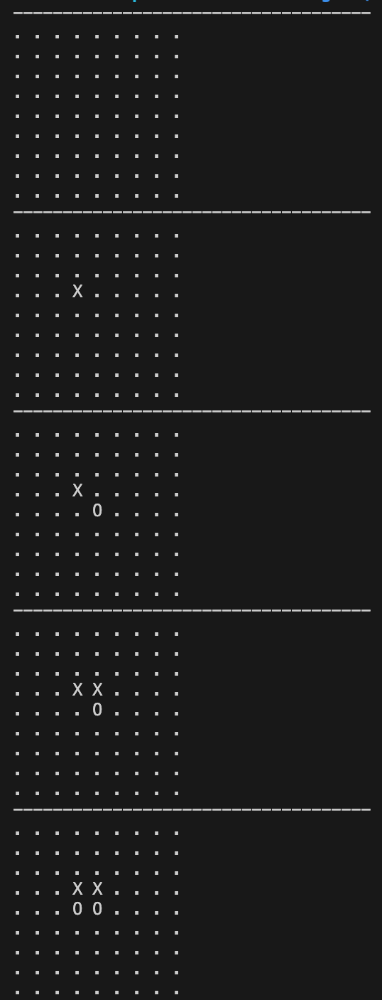
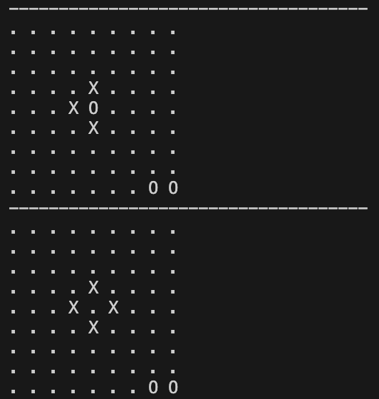
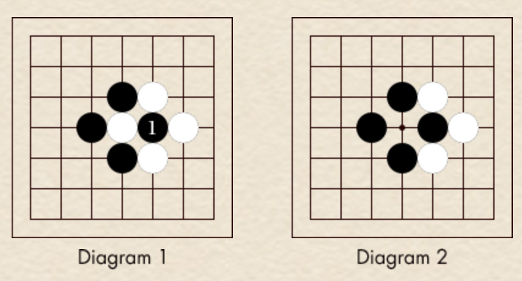
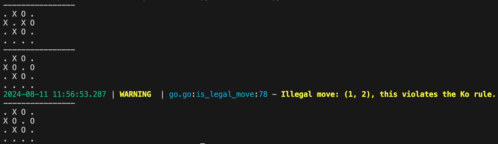
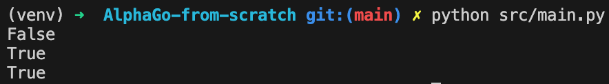
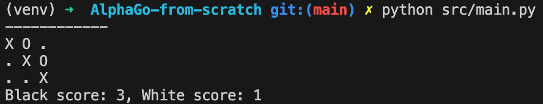

# Implement Go from Scratch
<span class="date">*18th August 2024*</span>

Let's not beat around the bush. I have absolutely no idea how to play go and even less of an idea of how to implement it in Python, but fuck it, I'll try anyway.

I'll start where I always start, watching YouTube tutorials.

- [How To Play Go (Beginner Tutorial)](https://www.youtube.com/watch?v=cFVM_hwh56s)
- [How to Play Go: Rules Explained | Beginner Tutorial on Go Game, Baduk, Weiqi](https://www.youtube.com/watch?v=oZTdT8MQexk)

## Building the Board

> *"The journey of a thousand miles begins with one step."*  
> &nbsp; - Lao Tzu

We can't start implementing a game without a place to implement it first. Let's just start with making an empty board. File structure is key, so I'll create a new folder called `go/` and have a `go.py` file within to contain the game logic. Very creative. Given that we will have an item (the board) that has a state (the positions of stones) and actions (playing moves on the board), this seems to lend itself very nicely to being its own class. We'll call that class `GoGame`. There are a few constants that we can also define right off the bat, the current stone at a position, we'll have `EMPTY` as 0, `BLACK` as 1, and `WHITE` as -1.

```python
class GoGame:
    EMPTY = 0
    BLACK = 1
    WHITE = -1

    def __init__(self):
        pass
```

Based on the videos, you can also have different board sizes to the standard 19x19, so let's add the `board_size` as an argument to the constructor, with a default of 19. We can then create a 2D list of `EMPTY` values to represent the board at the start of the game. Numpy has a handy `np.zeros` function that can do this for us. Adding this directly into the constructor might make it a little crowded, so we'll split this into a separate function to keep things nice and clean. We'll call this function `initialize_board()`, however, I'd like the record to show that I'm actually British and can spell initialise correctly, with an s. I am only conforming to the American because I was once told off by my manager for using the British (correct) spelling, which is not in accordance with the PEP 8 Style Guide, which, he pointed out is American and therefore the correct spelling is initialize. I'm still bitter about it.

```python
class GoGame:
    EMPTY = 0
    BLACK = 1
    WHITE = -1

    def __init__(self, board_size=19):
        self.board_size = board_size
        self.board = self.initialize_board()

    def initialize_board(self):
        return np.zeros((self.board_size, self.board_size), dtype=int)
```

While we're at it, a nice `print_board()` function would be useful. We can use a dictionary to map the values to a character to make it easier to read. We'll also add a `__str__` function for finesse.

```python
class GoGame:
    EMPTY = 0
    BLACK = 1
    WHITE = -1
    SYMBOLS = {
        EMPTY: '.',
        BLACK: 'X',
        WHITE: 'O'
    }

    def __init__(self, board_size=19):
        self.board_size = board_size
        self.board = self.initialize_board()

    def initialize_board(self):
        return np.zeros((self.board_size, self.board_size), dtype=int)

    def print_board(self):
        print("-" * self.board_size * 4)
        for row in self.board:
            print(" ".join([self.SYMBOLS[x] for x in row]))

    def __str__(self):
        print("-" * self.board_size * 4)
        return "\n".join([" ".join([self.SYMBOLS[x] for x in row]) for row in self.board])
```

Excellent, let's test this out! A main.py file should do the trick. We'll import the `GoGame` class, create a new instance of it, and print out, hopefully, a 19x19 grid of dots.

```python
from go.go import GoGame

if __name__ == "__main__":
    game = GoGame()
    game.print_board()
```

Running `python main.py` should give us that grid of dots. And it does! Great success!

## Playing Moves

> *"Let your plans be dark and impenetrable as night, and when you move, fall like a thunderbolt."* .  
> &nbsp; - Sun Tzu, The Art of War

Next we need to be able to actually place stones on the board. We'll add a `play_move()` function that takes the row and column of the board as inputs. To do this, we need to know the current player and if the move is legal. We'll add a `current_player` attribute to the class to keep track of whose turn it is. Black usually starts the game, so we'll set this to `BLACK` in the constructor.

To determine if a move is valid, we need to check a few things:
1. The position is within the bounds of the board.
2. The position is empty.
3. Other things specific to the game of Go that I don't understand enough to implement yet.

We'll add an `is_legal_move()` function to check these conditions, which we'll call from `play_move()`. If the move is legal, we'll update the board with the new stone and switch the current player. If not, we'll log a warning and ask the player to make a different move.

```python
class GoGame:
    EMPTY = 0
    BLACK = 1
    WHITE = -1
    SYMBOLS = {
        EMPTY: '.',
        BLACK: 'X',
        WHITE: 'O'
    }

    def __init__(self, board_size=19):
        self.board_size = board_size
        self.board = self.initialize_board()
        self.current_player = self.BLACK

    def initialize_board(self):
        return np.zeros((self.board_size, self.board_size), dtype=int)

    def print_board(self):
        print("-" * self.board_size * 4)
        for row in self.board:
            print(" ".join([self.SYMBOLS[x] for x in row]))

    def play_move(self, row, col):
        if self.is_legal_move(row, col):
            self.board[row, col] = self.current_player
            self.current_player = -self.current_player
        else:
            logger.warning("Please play a different move.")

    def is_on_board(self, x, y):
        return 0 <= x < self.board_size and 0 <= y < self.board_size

    def is_legal_move(self, row, col):
        if not self.is_on_board(x, y):
            logger.warning(f"Illegal move: ({x}, {y}), this move is out of bounds.")
            return False

        if self.board[x, y] != self.EMPTY:
            logger.warning(f"Illegal move: ({x}, {y}), there is already a stone there.")
            return False

        return True

    def __str__(self):
        print("-" * self.board_size * 4)
        return "\n".join([" ".join([self.SYMBOLS[x] for x in row]) for row in self.board])
```

Let's test this out by playing a few moves. We'll add a few moves to the main.py file and print the board after each move. We'll use board size 9 for now to make it easier to see what's going on.

```python
from go.go import GoGame

if __name__ == "__main__":
    game = GoGame(board_size=9)
    game.print_board()

    game.play_move(3, 3)
    game.print_board()

    game.play_move(4, 4)
    game.print_board()

    game.play_move(3, 4)
    game.print_board()

    game.play_move(4, 3)
    game.print_board()
```

<div style="text-align: center;">
    
</div>

Great! As boring as the output looks, it's exactly what we are after. We can now place stones on the board. We can also see that the current player is switching after each move. We're making progress! Slow progress, but progress nonetheless.

## Capturing

> *"The supreme art of war is to subdue the enemy without fighting."*  
> &nbsp; - Sun Tzu, The Art of War

Now playing moves is sorted, it's time for some fun stuff, capturing logic. From my limited knowledge of Go, I know that stones can be captured if a group of your stones are surrounded by the opponent's stones, to be more fancy, if your group of stones have no liberties. We'll need to add a `get_group()` function that will return all your stones that are connected to the stone at the given position. To do this, we could use recursion, but I think that's just overcomplicating things. We'll use a queue instead. We will have a `group` variable to hold all the stone positions in the current group and a `to_explore` queue to hold the positions we need to check next. We'll start by adding the current position to the `to_explore` queue and then begin a loop. We'll pop the first position from the `to_explore` queue, check if it's already in the `group`, if not, we'll add it to the `group` and get a list of all neighbouring position, regardless of if they are empty (we'll use a helper function for this). We'll then loop through the neighbouring stones, check if they contain a stone of the same colour as the original, adding them to the `to_explore` queue if they are. We'll continue this until the `to_explore` queue is empty. We'll then return the `group` of stones.

```python
 def get_group(self, x, y):
    """Returns all stones in the group connected to (x, y)."""
    group = []
    to_explore = [(x, y)]
    while to_explore:
        current = to_explore.pop()
        if current not in group:
            group.append(current)
            neighbors = self.get_neighbors(current[0], current[1])
            for n in neighbors:
                # Check the neighbour is the same colour as the current stone
                if self.board[n[0], n[1]] == self.board[x, y]:
                    to_explore.append(n)
    return group

def get_neighbors(self, x, y):
    """Returns the list of neighbors for a given position."""
    neighbors = []
    # Get the neighbors up, down, left, and right
    for dx, dy in [(-1, 0), (1, 0), (0, -1), (0, 1)]:
        if self.is_on_board(x + dx, y + dy):
            neighbors.append((x + dx, y + dy))
    return neighbors
```

Now that we have a group of stones, we can check if it has any liberties. We'll add a `has_liberties()` function that will return a boolean depending of if your stones are fully surrounded by the opponent's or not. If a group of stones has no liberties, it is captured and removed from the board. These two step lend themselves quite nicely to being their own functions, `remove_group()` and `capture_stones()`.

To check if a group has liberties, we'll loop through all the stones in the group and get their neighbours. We'll then loop through all of the neighbours and check if they are empty. If we find any empty neighbours, the group has liberties and we can immediately return `True`, but if we get through the loop without finding any liberties, we'll return `False`.

To remove a group of stones, we simply loop through all the stones in the group and set them to `EMPTY`. Easy. I think captured stones also related to points somehow, so let's save them as class attributes.

Finally, we can put both of those together into a `capture_stones()` function. This will be called when a stone is placed, to check if there is anything to capture. So, when we place a stone, we will first check if it is neighbouring any opponent stones because if not, we can just ignore the capturing logic altogether since there is no way for the stone to be captured. If it is neighbouring an opponent stone, we'll get the group of stones connected to that neighbouring stone and check if it has any liberties. If it doesn't, that means our group of stones full surrounds theirs and we can remove them as captured! Incredible stuff.

```python
def has_liberties(self, group):
    """Checks if any stone in the group has liberties (empty adjacent points)."""
    for stone in group:
        neighbors = self.get_neighbors(stone[0], stone[1])
        for n in neighbors:
            if self.board[n[0], n[1]] == self.EMPTY:
                return True
    return False

def remove_group(self, group):
    for stone in group:
        if self.board[stone[0], stone[1]] == self.BLACK:
                self.captured_black += 1
            elif self.board[stone[0], stone[1]] == self.WHITE:
                self.captured_white += 1
            self.board[stone[0], stone[1]] = self.EMPTY

def capture_stones(self, x, y):
    """Checks and captures opponent stones if they have no liberties."""
    opponent = -self.current_player
    neighbors = self.get_neighbors(x, y)
    for n in neighbors:
        if self.board[n[0], n[1]] == opponent:
            group = self.get_group(n[0], n[1])
            if not self.has_liberties(group):
                self.remove_group(group)
```

We should be checking this every time a move is made. Luckily, we have a function that is called every time a move is made, `play_move()`. We can simply call `capture_stones()` at the end of this function and call it a day.

```python
def play_move(self, x, y):
    if self.is_legal_move(row, col):
        self.board[row, col] = self.current_player
        self.capture_stones(x, y)
        self.current_player = -self.current_player
    else:
        logger.warning("Illegal move")
```

Let's test this bad boy out! We'll add a few more moves to the main.py file and print the board after each move.

```python
from go.go import GoGame

if __name__ == "__main__":
    game = GoGame(board_size=9)
    game.play_move(3, 4)
    game.play_move(4, 4)
    game.play_move(4, 3)
    game.play_move(8, 8)
    game.play_move(5, 4)
    game.play_move(8, 7)
    game.print_board()
    game.play_move(4, 5)
    game.print_board()
```

<div style="text-align: center;">
    
</div>

I am so good at Python!

Unfortunately, I'm not so good at Go and there are a couple of rules around placing stones that I've missed. You can't place a stone where it would be immediately captured (Suicide), and you can't place a stone where it would recreate the previous board state (Ko). So we need to find a way of working both of these in. We'll start with Suicide.

This seems straightforward enough, place a stone, then check if its group has any liberties. However, there is an edge case to be wary of, and that's when you play a stone that would be captured, but you capture their stones first. I appreciate my words are poor at best, so here's an image to make things a bit clearer.

<div style="text-align: center;">
    
</div>

Source: [The Ko](https://www.pandanet.co.jp/English/learning_go/learning_go_8.html)

Here, black is allowed to play the stone labelled 1, despite it having no liberties. That is because, before the liberties are checked, black can capture white's stone to the left, which is left without any liberties itself after the 1 stone is played.

Therefore, before we check if a played stone has any liberties, we need to perform the associated capturing, luckily we already have some functions that can do this for us. We'll add this to the `is_legal_move()` function. We will copy the current board state, and store the original captured stones (to reset it later). We will then play the move, capture any stones, and check if the group has any liberties. If it does, we'll reset the board to the original state and return `True`, if not, we'll reset the board and return `False`.

```python
def is_legal_move(self, x, y):
    if not self.is_on_board(x, y):
        logger.warning(f"Illegal move: ({x}, {y}), this move is out of bounds.")
        return False

    if not self.is_empty(x, y):
        logger.warning(f"Illegal move: ({x}, {y}), there is already a stone there.")
        return False

    # Save current board state
    original_board = self.board.copy()
    original_captured_black = self.captured_black
    original_captured_white = self.captured_white

    # Simulate placing the stone
    self.board[x, y] = self.current_player

    # Capture opponent stones
    self.capture_stones(x, y)

    # Check for suicide
    if not self.has_liberties(self.get_group(x, y)):
        self.board = original_board  # Restore board state
        self.captured_black = original_captured_black
        self.captured_white = original_captured_white
        logger.warning(f"Illegal move: ({x}, {y}), this violates the Suicide rule.")
        return False

    # Restore board state and return true (legal move)
    self.board = original_board
    self.captured_black = original_captured_black
    self.captured_white = original_captured_white
    return True
```

That wasn't so bad. Now what is this Ko rule? Thankfully, [the same website](https://www.pandanet.co.jp/English/learning_go/learning_go_8.html) where I stole that diagram has a wonderful explanation. It actually comes off the back of a capture like the one above. Based on the Suicide rule, white should be able to play exactly where the white stone was just captured, and take back the black 1 stone. However, by this logic, black can just do the same thing again! You can quickly see how this is an issue as we spiral into a neverending capture-fest. Therefore, to prevent this, we have the Ko rule, which prevents automatic recapture and states that the board may not repeat a position. If white wishes to recapture, they must use one move to play elsewhere (changing the board position), and then capture on their subsequent turn.

Given that, the logical check to see if the rule has been violated would be to keep a running set of all previous board states. Then, we can simply check if the current board is in that set, violating the rule if it is, and complying if not. Technically, we probably only need to check the previous couple of board states, as a move will always be played except when a player passes, and if both players do that consecutively, the game is over. But, I'm not looking to hyper-optimise at the moment, so we'll just keep a running set of all board states.

We'll add a `self.previous_boards` set to the class and add the current board state to it at the end of the `play_move()` function. For ease, we'll flatten the board to a 1D array, and make it a tuple. We'll then add a check for the Ko rule in the `is_legal_move()` function. If the current board state is in the `previous_boards` set, we'll return `False`, making sure to reset the board and captured stones before exiting the function.

```python
def is_legal_move(self, x, y):
    if not self.is_on_board(x, y):
        logger.warning(f"Illegal move: ({x}, {y}), this move is out of bounds.")
        return False

    if not self.is_empty(x, y):
        logger.warning(f"Illegal move: ({x}, {y}), there is already a stone there.")
        return False

    # Save current board state
    original_board = self.board.copy()
    original_captured_black = self.captured_black
    original_captured_white = self.captured_white

    # Simulate placing the stone
    self.board[x, y] = self.current_player

    # Capture opponent stones
    self.capture_stones(x, y)

    # Check for suicide
    if not self.has_liberties(self.get_group(x, y)):
        self.board = original_board  # Restore board state
        self.captured_black = original_captured_black
        self.captured_white = original_captured_white
        logger.warning(f"Illegal move: ({x}, {y}), this violates the Suicide rule.")
        return False

    # Check for Ko
    board_tuple = tuple(self.board.flatten())
    if board_tuple in self.previous_boards:
        self.board = original_board  # Restore board state
        self.captured_black = original_captured_black
        self.captured_white = original_captured_white
        logger.warning(f"Illegal move: ({x}, {y}), this violates the Ko rule.")
        return False

    # Restore board state and return true (legal move)
    self.board = original_board
    self.captured_black = original_captured_black
    self.captured_white = original_captured_white
    return True

def play_move(self, x, y):
    if self.is_legal_move(row, col):
        self.board[row, col] = self.current_player
        self.capture_stones(x, y)
        board_tuple = tuple(self.board.flatten())
        self.previous_boards.add(board_tuple)
        self.current_player = -self.current_player
    else:
        logger.warning("Illegal move")
```

I think a cheeky test is in order, we should get Illegal move warnings.

```python
if __name__ == "__main__":
    game = GoGame(board_size=4)
    game.play_move(2, 1)
    game.play_move(2, 2)
    game.play_move(1, 2)
    game.play_move(0, 2)
    game.play_move(0, 1)
    game.play_move(1, 3)
    game.play_move(1, 0)
    game.print_board()
    game.play_move(1, 1)
    game.print_board()
    game.play_move(1, 2)
    game.print_board()
```

<br>

<div style="text-align: center;">
    
</div>

Boom! How do you like them apples? We can now capture stones! I'm feeling pretty good about this.

## Game End

> *"There is no instance of a nation benefitting from prolonged warfare."*  
> &nbsp; - Sun Tzu, The Art of War

Next up, we need to add some scoring and game end logic. I know that the game ends when both players pass consecutively, but I'm not sure how the scoring works. Easy solution, let's add the game end stuff first. We'll add a `pass_turn()` function that will switch the current player and check if both players have passed. If they have, we'll print the board and end the game. To track if a player has passed, we'll add a `pass_count` attribute to the class, incrementing it when the `pass_turn()` function is called, and resetting it when a move is made.

Players can also just resign, so we'll add a `resign()` function that will end the game and declare the other player the winner. We'll add a `winner` attribute to keep track of the winner and a `game_over` attribute to track if the game is over or not. The latter seems kind of pointless, but I'm going to keep it in anyway. It would probably be useful to check if the game is over at the start of the `play_move()` function, but we'll leave that for now, mainly because I'm lazy.

Finally I hear that there is a maximum number of moves that can be made in a game, so we'll add a `move_count` attribute to the class and increment it every time a move is made, as well as a `max_moves` attribute that can be set by the user when the class is created. If the `move_count` reaches the maximum number of moves, we'll end the game and print the board. We can throw this into the `play_move()` function.

```python
def switch_player(self):
    self.current_player = -self.current_player

def pass_turn(self):
    self.pass_count += 1
    if self.pass_count >= 2:
        self.game_over = True
    else:
        self.switch_player()

def resign(self):
    self.game_over = True
    self.winner = -self.current_player

def play_move(self, x, y):
    if self.is_legal_move(row, col):
        self.board[row, col] = self.current_player
        self.capture_stones(x, y)
        self.pass_count = 0
        self.move_count += 1
        if self.move_count >= self.max_moves:
            self.game_over = True
        else:
            self.switch_player()
    else:
        logger.warning("Illegal move")
```

Let's just quickly check if that works by resigning, then resetting and passing twice.

```python
from go.go import GoGame

if __name__ == "__main__":
    game = GoGame(board_size=9)
    print(game.game_over)
    game.resign()
    print(game.game_over)
    game = GoGame(board_size=9)
    game.pass_turn()
    game.pass_turn()
    print(game.game_over)
```

<br>

<div style="text-align: center;">
    
</div>

Sweet! Go is working well!

Now, scoring. Fuck.

## Scoring

> *"If you know the enemy and know yourself, you need not fear the result of a hundred battles."*  
> &nbsp; - Sun Tzu, The Art of War

We knew this was coming, back to YouTube.

- [Sample Game of Go and Territory Scoring](https://www.youtube.com/watch?v=hUU1wZHnb5A)
- [Learn to Score in the game Go in under five minutes](https://www.youtube.com/watch?v=g3xycgafOxw)

So based on that, scoring is all about the territory you occupy, the empty spaces that are surrounded by your stones, one point for each space. You also get a point for each of your opponent's stones that you've captured. Whoever has more points at the end is the winner! There's also a handicap bonus for going second, but that'll be easy enough to add on as well.

Excellent, this is looking a bit simplier than I initially expected, but I'm sure that delusion will come crashing down soon enough.

We'll add a `score_game()` function that we can call when we want to work out who's won. This will start with creating two variables, `black_score` and `white_score`, which will be set equal to the associated captured stones. I knew those captured stones attributes would come in handy! Next, we'll work out the territory. The territory is the number of empty spaces that are surrounded by stones of the same colour. We'll loop through the board and check if the space is empty. If it is, we'll get the group of stones that surround it and check if they are all the same colour. If they are, we'll add the number of empty spaces to the score of that colour. To actually find the territory and decide if it's surrounded, we'll use a breadth-first search. We'll add a `bfs()` function that will return the territory of a given position and a boolean value for if it is fully surrounded or not. This will be similar to the `get_group()` function. We'll start with a `queue` of spaces to visit, being initialised at the given position We will also have a set of visited places and a set of territories (empty spaces in the same group as the starting space). We'll then loop through the queue, popping the first space and then checking if it is empty. If it is, we'll add it to the territory set. Then we'll get the neighbours of the space and loop through them, checking if we have visited them or not. If we have, we just keep going in the loop, but if not, we add them to the `queue`. However, if the space is not empty, we'll check if it is the same colour as the opponent. If so, we'll break out of the bfs function and return `False` to indicate that the territory is not fully surrounded. If it is the same colour, we'll break out of that stage in the loop and move onto the next space in the queue.

Also, I just thought of a stupid edge case where both players pass immediately. The current logic would add all the territory to black, so we need to add a little something to check if the board is empty first, and then declare the game a draw.

```python
def score_game(self):
    """
    Returns the score of the game for both players by calculating the terriroty and captured stones.
    """
    # Check if the entire board is blank
    if np.all(self.board == self.EMPTY):
        return 0, 0  # Both players have a score of zero

    black_score = self.captured_white
    white_score = self.captured_black

    def bfs(x, y, player):
        """Performs BFS to find territory surrounded by the given player."""
        queue = [(x, y)]
        visited = set(queue)
        territory = set()
        surrounded = True

        while queue:
            cx, cy = queue.pop(0)
            visited.add((cx, cy))
            if self.board[cx, cy] == self.EMPTY:
                territory.add((cx, cy))
                for nx, ny in self.get_neighbours(cx, cy):
                    if (nx, ny) not in visited:
                        queue.append((nx, ny))
            elif self.board[cx, cy] == -player:
                surrounded = False
                continue
            else:
                continue

        return territory, surrounded

    visited = set()
    for x in range(self.board_size):
        for y in range(self.board_size):
            if (x, y) not in visited and self.board[x, y] == self.EMPTY:
                black_territory, black_surrounded = bfs(x, y, self.BLACK)
                white_territory, white_surrounded = bfs(x, y, self.WHITE)

                if black_surrounded:
                    black_score += len(black_territory)
                elif white_surrounded:
                    white_score += len(white_territory)

                visited.update(black_territory)
                visited.update(white_territory)

    return black_score, white_score
```

Let's give this a test. We'll have a 3x3 board with black stones diagonally across the middle, and white stones one diagonal row up and to the right (the board is printed out below for reference). Black should have a score of 3 and white should have a score of 1.

Before you start shouting at me, I think white probably should score zero because in this situation, their stones are actually dead since you can play a black stone in the top left and capture. But here, I'm mainly testing if the scoring logic works.

```python
if __name__ == "__main__":
    game = GoGame(board_size=3)
    game.board = np.array([[1, -1, 0], [0, 1, -1], [0, 0, 1]])
    game.print_board()
    score = game.score_game()
    print(f"Black score: {score[0]}, White score: {score[1]}")
```

<br>

<div style="text-align: center;">
    
</div>

Excellent, we have a working game! For some slight pizzazz, we'll even add a komi bonus for white, which is the number of points given to white to compensate for going second. We'll add a `komi` attribute to the class and add it to the white score at the start of the `score_game()` function.

```python
def __init__(self, board_size=19, komi=6.5):
    self.komi = komi
    ...

def score_game(self):
    """
    Returns the score of the game for both players by calculating the terriroty and captured stones.
    """
    # Check if the entire board is blank
    if np.all(self.board == self.EMPTY):
        return 0, 0  # Both players have a score of zero

    black_score = self.captured_white
    white_score = self.captured_black + self.komi
    ...
```

And that, ladies and gentlemen, is that. Time to implement AlphaGo.

P.S. I still have basically no idea how to play Go, so I apologise for any mistaken rules or general inepitude that may have caused offense.

## References

- [How To Play Go (Beginner Tutorial)](https://www.youtube.com/watch?v=cFVM_hwh56s)
- [How to Play Go: Rules Explained | Beginner Tutorial on Go Game, Baduk, Weiqi](https://www.youtube.com/watch?v=oZTdT8MQexk)
- [The Ko](https://www.pandanet.co.jp/English/learning_go/learning_go_8.html)
- [Sample Game of Go and Territory Scoring](https://www.youtube.com/watch?v=hUU1wZHnb5A)
- [Learn to Score in the game Go in under five minutes](https://www.youtube.com/watch?v=g3xycgafOxw)

## Contact

If you found this useful, or more likely, found many, many mistakes, I'd love to hear from you! <br>
Email: thomaschia@chia.monster